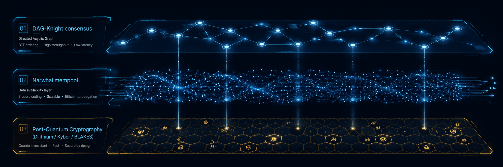
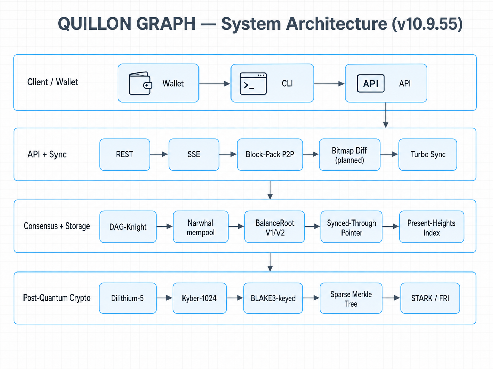

# Quillon Graph



[](https://opensource.org/licenses/Apache-2.0)
[](https://www.rust-lang.org/)
[](https://quillon.xyz)
[](https://github.com/deme-plata/q-narwhalknight/commits/main)

> Quantum-resistant DAG-BFT blockchain — DAG-Knight consensus over a Narwhal mempool, post-quantum signatures (Dilithium-5, Kyber-1024), BLAKE3-keyed commitments, and a Sparse Merkle Tree balance commitment. Production network running on mainnet-genesis with multi-server HA.

Live at **[quillon.xyz](https://quillon.xyz)**. Repository tag: `v10.9.55` and counting.

---

## At a glance

| | |
|---|---|
| **Consensus** | DAG-Knight with VDF-based anchor election |
| **Mempool** | Narwhal with reliable broadcast (Bracha RB) |
| **Signatures** | Dilithium-5 + Ed25519 hybrid |
| **KEM** | Kyber-1024 |
| **Hash** | BLAKE3-keyed |
| **Block time** | ~1 second |
| **Network** | mainnet-genesis (live), 4 production bootstrap nodes |

---

## System architecture



The original phased description is preserved below for historical context. See `docs/technical-review-sparse-chain-truth-v1.md` for the empirical chain-state truth and `docs/v10.9.55-balance-replay-removal-2026-05-18.md` for the most recent operational lesson.

---

🌟 **Quantum-Enhanced DAG-BFT Consensus with Distributed AI & Triple-Layer Anonymity**

Q-NarwhalKnight is a blockchain consensus system that combines the efficiency of DAG-Knight consensus with Narwhal mempool, quantum-ready cryptographic primitives, and production-grade Tor integration for complete network anonymity. This implementation provides a phased approach to quantum-resistance, starting with classical cryptography (Phase 0) and progressively upgrading to full quantum protocols (Phase 4).

## 🔬 Architecture Overview

Q-NarwhalKnight implements a four-tier quantum threat model with seamless cryptographic agility:

### Phase 0: Classical Foundation (Current Implementation)
- **Consensus**: DAG-Knight with quantum-enhanced anchor election
- **Mempool**: Narwhal with reliable broadcast (Bracha's protocol)
- **Networking**: libp2p with Ed25519 + QUIC transport
- **Ordering**: Zero-message complexity BFT with VDF-based randomness

### Phase 1: Post-Quantum Transition (Implemented)
- **Crypto-Agile Framework**: Seamless algorithm negotiation
- **Signatures**: Dilithium5 (post-quantum digital signatures)  
- **Key Exchange**: Kyber1024 (post-quantum KEM)
- **Hybrid Security**: Classical + post-quantum dual protection

### Phase 2-4: Quantum Future (Planned)
- **Quantum Random Number Generation** (QRNG)
- **Quantum Key Distribution** (QKD) networking
- **Lattice-based Verifiable Random Functions**
- **STARK-only zkVM for quantum-resistant proofs**

## 🚀 Quick Start

### Prerequisites
- Rust 1.70+ with Cargo
- libp2p networking stack
- Optional: PostgreSQL for persistent storage

### Build & Run
```bash
# Clone the repository
git clone https://github.com/deme-plata/q-narwhalknight.git
cd q-narwhalknight

# Build the workspace (use 10-hour timeout for quantum components)
timeout 36000 cargo build --release

# Run the API server with Tor anonymity
./target/release/q-api-server

# Run the high-performance miner (local node)
./target/release/q-miner \
  --mode solo \
  --wallet qnk<your-64-char-hex-address> \
  --threads 4 \
  --intensity 7

# Run miner connected to remote node
./target/release/q-miner \
  --mode solo \
  --wallet qnk<your-64-char-hex-address> \
  --threads 8 \
  --intensity 9 \
  --server http://185.182.185.227:8080

# Benchmark your hardware
./target/release/q-miner --benchmark --threads 16 --duration 60
```

### Configuration
```toml
[network]
listen_addr = "/ip4/0.0.0.0/tcp/7000"
bootstrap_peers = []

[consensus]
node_id = "auto" # Or specify 32-byte hex
byzantine_tolerance = 1 # f parameter (supports up to 3f+1 total nodes)
delta_rounds = 4 # Commit latency parameter

[crypto]
phase = "Phase0" # "Phase0" | "Phase1" 
auto_upgrade = true
```

## 🏗️ Project Structure

```
Q-NarwhalKnight/
├── crates/
│   ├── q-types/           # Core type definitions and primitives
│   ├── q-wallet/          # Wallet management and key handling  
│   ├── q-api-server/      # REST API and real-time streaming
│   ├── q-visualizer/      # Quantum state visualization
│   ├── q-narwhal-core/    # Narwhal mempool implementation
│   ├── q-dag-knight/      # DAG-Knight consensus engine
│   └── q-network/         # libp2p networking with crypto-agility
├── papers/                # Academic papers and documentation
└── docs/                  # Additional documentation
```

## 🎯 Key Features

### ⚡ High Performance
- **Zero-message complexity**: No additional consensus communication overhead
- **Parallel processing**: Asynchronous vertex processing and validation
- **Stream processing**: Real-time updates with <50ms latency
- **Scalable architecture**: Supports thousands of validators

### 🔐 Quantum-Ready Security
- **Cryptographic agility**: Hot-swappable algorithm suites
- **Post-quantum signatures**: Dilithium5 lattice-based signatures
- **Hybrid security**: Classical + quantum-resistant dual protection
- **VDF-based randomness**: Quantum-enhanced verifiable delay functions

### 🌐 Advanced Networking & Anonymity
- **libp2p integration**: Modern P2P networking with QUIC transport
- **Tor integration**: Embedded Arti Tor client for complete network anonymity
- **Triple-layer anonymity**: Tor + Quantum mixing + VDF-based unlinkability
- **Gossip protocol**: Efficient message propagation
- **Peer discovery**: Capability-aware peer management with .onion support
- **Network resilience**: Byzantine-fault-tolerant networking
- **Zero IP leakage**: All validator communications routed through Tor circuits

### 📊 Consensus Innovation
- **DAG-Knight ordering**: Deterministic transaction ordering
- **Quantum anchor election**: VDF-based leader selection
- **Narwhal mempool**: High-throughput transaction batching
- **Commit protocols**: Multiple commit paths for optimal latency

### ⛏️ High-Performance Mining
- **Multi-threaded CPU mining**: Optimized DAG-Knight PoW with VDF verification
- **Remote mining support**: Connect to any node via `--server` parameter
- **Real-time updates**: Server-Sent Events (SSE) for instant reward notifications
- **Adaptive difficulty**: Dynamic adjustment based on network hashrate
- **Quantum-resistant PoW**: VDF-enhanced mining algorithm
- **Benchmark mode**: Performance testing and hardware optimization

### 💰 **Transparent Development Fee** (v0.2.0-beta)

Q-NarwhalKnight implements a **1% development fee** on all mining rewards to ensure sustainable, long-term project development.

**Reward Split:**
- **99%** → Miner (you)
- **1%** → Development Fund (founder wallet)

**Example:** If block reward is 2.0 QNK, you receive **1.98 QNK** and **0.02 QNK** funds development.

**What This Funds:**
- Core protocol development and bug fixes
- Post-quantum cryptography research (Phases 2-4)
- Network infrastructure and bootstrap nodes
- Security audits and penetration testing
- Academic publications and peer review
- Community support and documentation

**Transparency:**
- **Founder Wallet**: `qnk8f7a6b5c4d3e2f1a0b9c8d7e6f5a4b3c2d1e0f1a2b3c4d5e6f7a8b9c0d1e2f3a`
- **Full Documentation**: See [`DEVELOPMENT_FEE_TRANSPARENCY.md`](./DEVELOPMENT_FEE_TRANSPARENCY.md)
- **Open Source**: All fee logic is visible in the source code
- **On-Chain Verification**: Founder wallet balance is publicly auditable

**Security:** The network uses AEGIS-QL post-quantum authentication to ensure only authorized miners can participate, preventing unauthorized forks that bypass the development fee.

## 🔬 Research & Papers

This implementation is based on cutting-edge research in:
- **DAG-Knight**: Asynchronous BFT consensus ([DISC 2021](https://arxiv.org/abs/2102.08325))
- **Narwhal**: High-throughput mempool ([EuroSys 2022](https://arxiv.org/abs/2105.11827))
- **Post-Quantum Cryptography**: NIST standardized algorithms
- **Quantum Networking**: QKD and quantum-enhanced protocols

See `papers/quantum-aesthetics.pdf` for our comprehensive analysis of quantum consensus aesthetics.

## 🧪 Testing & Development

### Unit Tests
```bash
# Run all tests
cargo test --workspace

# Run specific crate tests
cargo test -p q-dag-knight

# Run with logging
RUST_LOG=debug cargo test
```

### Integration Tests
```bash
# End-to-end consensus test
cargo test --test integration_consensus

# Network layer tests  
cargo test --test network_integration

# Performance benchmarks
cargo bench
```

### Load Testing
```bash
# Simulate high-throughput scenario
cargo run --bin q-load-tester -- \
    --nodes 4 \
    --transactions-per-second 1000 \
    --duration 60s
```

## 🌟 API Documentation

### REST Endpoints
```
POST   /wallets              # Create new wallet
GET    /wallets/{id}          # Get wallet info
POST   /transactions         # Submit transaction
GET    /consensus/status      # Get consensus state
GET    /network/peers         # List connected peers
GET    /metrics              # Prometheus metrics
```

### WebSocket Streams
```
/ws/blocks                   # Real-time block notifications
/ws/transactions            # Transaction confirmations
/ws/consensus              # Consensus state updates
/ws/quantum/visualization  # Quantum state visualization
```

### Server-Sent Events
```
/stream/consensus          # Consensus events
/stream/network           # Network events  
/stream/quantum/beacons   # Quantum beacon updates
```

## 🎨 Quantum Visualization

Q-NarwhalKnight includes advanced quantum state visualization:

- **Rainbow-box quantum states**: Multi-dimensional qubit representation
- **DAG entanglement patterns**: Moiré interference visualization
- **QKD photon waterfalls**: Real-time quantum key distribution
- **STARK proof fractals**: Zero-knowledge proof visualization

Access visualizations at `/quantum/visualization` or via WebSocket streams.

## 💼 Dual Wallet Implementations

Q-NarwhalKnight offers two complementary wallet implementations:

### 🦀 Slint Native Wallet (`/gui`)
- **Technology**: Rust + Slint UI Framework
- **Platform**: Native desktop application (Linux, Windows, macOS)
- **Performance**: Zero-overhead native performance
- **Features**:
  - DAG consensus visualization with real-time updates
  - Network topology monitoring
  - Tor anonymity integration
  - Quantum entropy visualization
  - Narwhal mempool explorer
  - Phase transition monitoring
  - LVRF randomness visualization
  - VDF progress tracking
  - Canvas-based quantum visualizations

### ⚛️ React TypeScript Wallet (`/gui/quantum-wallet`)
- **Technology**: Vite + React + TypeScript
- **Platform**: Web-based PWA (Progressive Web App)
- **Performance**: Optimized with code splitting and lazy loading
- **Features**:
  - Modern responsive UI with dark mode
  - Wallet authentication with post-quantum signatures
  - Real-time transaction monitoring via SSE
  - DEX trading interface with liquidity pools
  - Mining dashboard with GPU/CPU support
  - CDP vault management for stablecoins
  - QR code scanner for mobile transactions
  - Session timeout with encrypted key storage
  - Token management and custom token support
  - Stripe payment integration
  - Download node packages directly from UI

Both wallets share the same backend API and provide complementary user experiences - native performance for power users and web accessibility for general users.

## 🤝 Contributing

We welcome contributions! Please see `CLAUDE.md` for detailed contribution guidelines and multi-server development processes.

### Development Setup
1. **Clone and build** the repository
2. **Review** architecture in `docs/` 
3. **Check** open issues and project roadmap
4. **Submit** pull requests with comprehensive tests

### Multi-Server Development
See `CLAUDE.md` for instructions on:
- Setting up distributed development environments
- Using shared `/mnt` folders across servers
- Coordinating through GitLab pipelines
- Contributing code via Claude Code integration

## 📋 Roadmap

### Phase 0 (Current) - Classical Foundation
- [x] DAG-Knight consensus engine
- [x] Narwhal mempool with reliable broadcast  
- [x] libp2p networking with gossip protocol
- [x] REST API and real-time streaming
- [x] Quantum state visualization
- [ ] Performance optimization and benchmarking

### Phase 1 (In Progress) - Post-Quantum Transition
- [x] Cryptographic agility framework
- [x] Dilithium5/Kyber1024 integration
- [x] Algorithm negotiation protocol
- [ ] Hybrid classical+post-quantum mode
- [ ] Migration tools and compatibility

### Phase 2 (Planned) - Quantum Enhancement
- [ ] QRNG hardware integration
- [ ] Lattice-based VRF implementation
- [ ] Quantum-enhanced VDF protocols
- [ ] STARK-only zkVM integration

### Phase 3-4 (Research) - Full Quantum
- [ ] QKD networking protocols
- [ ] Quantum fair queueing
- [ ] Advanced quantum consensus protocols
- [ ] Quantum error correction integration

## 🏷️ Version History

- **v0.0.3-beta** (Current): Production Beta Release
  - Dual wallet implementations: Slint (native Rust) + React TypeScript (web)
  - Full wallet authentication with post-quantum signatures (SHA-512 + noble-ed25519)
  - DEX integration with liquidity pools and real-time swap functionality
  - Session management with auto-timeout and encrypted key storage
  - Mining dashboard with SSE real-time updates
  - Transaction tunneling for privacy-preserving transfers
  - Database replication for high availability
  - AEGIS-QL quantum entanglement coordination language
  - Higgs-Hydro quantum vacuum simulation
  - Reticular chemistry robots for material synthesis
  - ZK-STARK batch prover integration
  - Comprehensive API documentation and testing suite
  - IPFS + RocksDB distributed storage layer
  - QUG/QUGUSD stablecoin with CDP vaults
  - Nitro Points loyalty system
  - Payment gateway integration (Stripe)

- **v0.0.2-beta**: Enhanced Features Release
  - Post-quantum wallet authentication
  - Real-time DEX with liquidity management
  - Privacy enhancements and transaction tunneling
  - Database replication architecture

- **v0.0.1-alpha**: Initial implementation with Phase 0 consensus and Phase 1 crypto-agility

- **v0.1.0** (Planned): Production-ready Phase 0 with performance optimizations
- **v0.2.0** (Planned): Complete Phase 1 post-quantum transition

## 📄 License

Apache-2.0 License - see `LICENSE` file for details.

## 🙏 Acknowledgments

- **DAG-Knight team** for the foundational consensus research
- **Narwhal/Bullshark authors** for mempool design
- **libp2p community** for networking infrastructure  
- **NIST** for post-quantum cryptography standards
- **Quantum-DAG Labs** for quantum consensus research

---

**Building the quantum-ready future of distributed consensus** ⚛️🚀